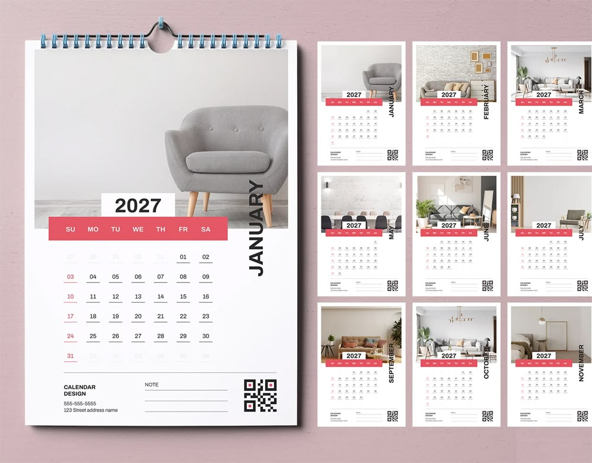
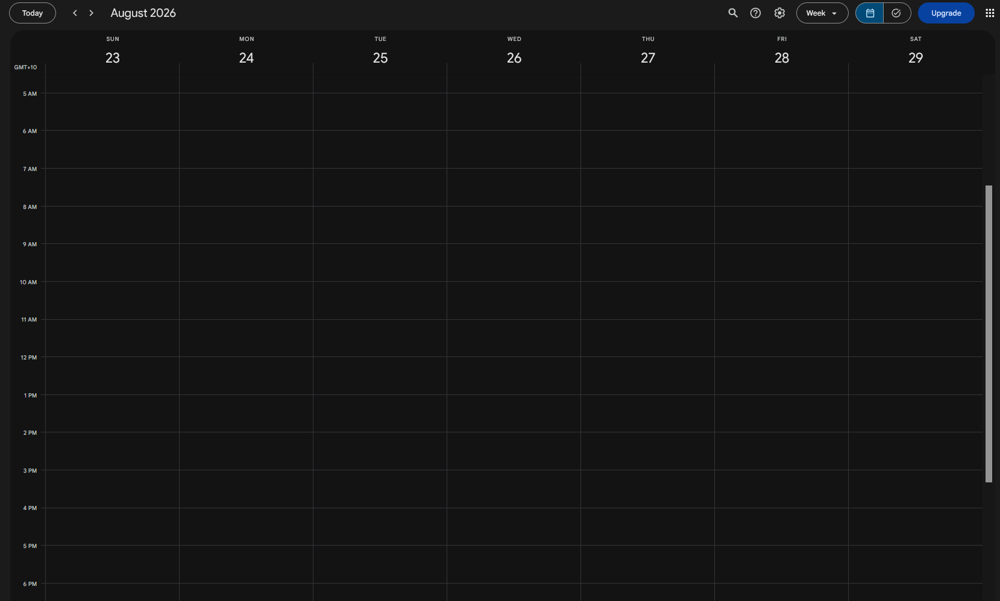

# What is a calendar? 

Traditionally, calendars were printed on paper. There may be 28-31 boxes per page, representing each day of a month. 

So if you squint hard enough, a calendar is a grid. 

With the digitization of calendars in the modern age, the shape of a calendar has also changed. The default Google Calendar view shows 7 days in a week, with the ability to label certain events on any of the 24 hours in a day. 

So, one Google Calendar page can be seen as a 7 x 24 grid. Each box of the grid can be 'filled' or 'unfilled' depending on whether an event is scheduled on it. So it is possible to use a Google Calendar page as a very low-resolution screen that can accomodate 7x24=168 pixels. 

There are a few things we can do with this information. 

# But can it play Bad Apple?

"Bad Apple!!" is a hit 2009 Japanese music video that is uniquely completely in black and white, making it the perfect test subject for our very low-resolution, two colour only screen. 

7 x 24 is still too few pixels though. So let's add a few more calendars. 

The demo below is rendered using 6 Google calendar windows on one laptop screen. This gives a combined resolution of 21 x 48 -- just barely enough to make the video distinguishable. This is done by using a script to schedule events across many weeks on 6 different calendars using the Google Calendar API, then using a browser automation script in <b>Playwright</b> to open the browser windows in the correct position, then repeatedly clicking the "Next week" button to advance the frames. 

> Fun fact: the full music video at 5fps takes about 20 Google Calendar years to render

Click <a href="https://www.youtube.com/watch?v=ggpb8buVtFk">here</a> to watch the demo

Made in 24 hours for NUS Hack n Roll 2026

